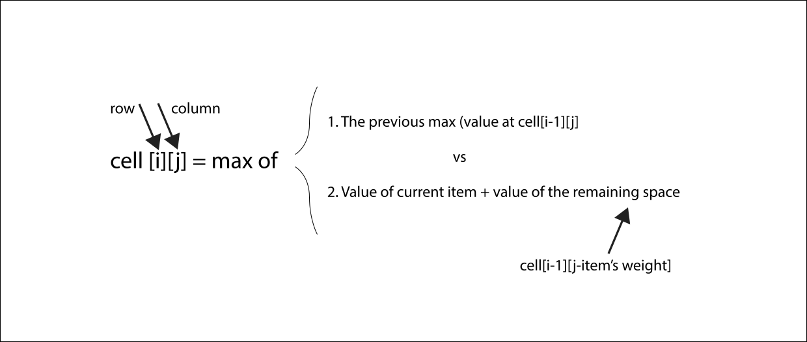
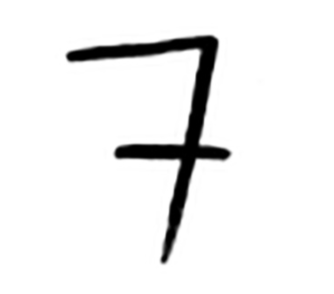
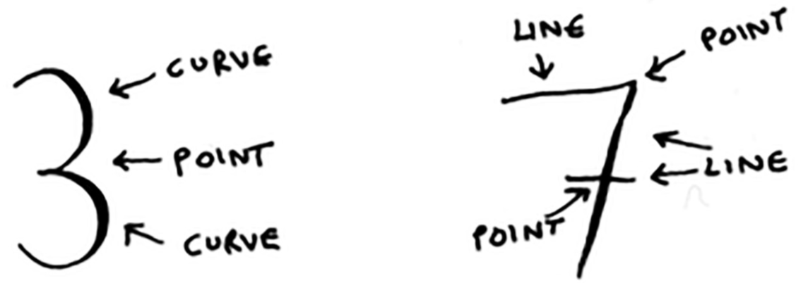
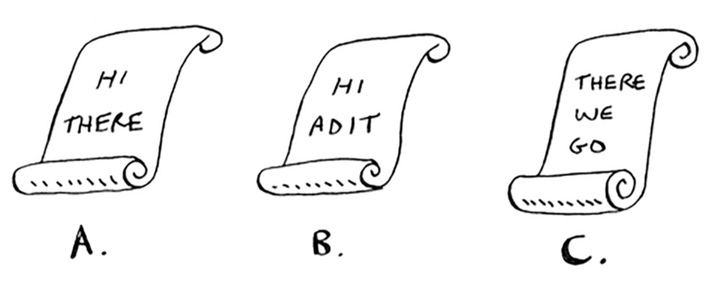

# Algorithms 
Notes from the book Grokking Algorithms by Aditya Y. Bhargava.

These are intro notes to algorithms. I feel like my algorithm notes are all over the place, in paper, my computer, in the back of my head, so I'm putting it all here for reference. 

## Intro to Algorithms
### Binary Search
* Binary Search
    * For any list n, binary search will take logbase2 n steps to run in the worst case whereas simple search will take n steps. Binary search runs in logarithmic time.
    * log reference
        * 2^3 = 8 <-> logbas2 8 = 3. (In other words, how many 2s do we multiply together to get 8).
        * In algorithms, log always means logbase2
    * Binary search only works when your list is sorted.

### Big O Notation
* Big O notation tells you how fast an algorithm is. Big O notation lets you compare the number of operations. For example, lets say you have a list of size of n. Simple search checks each element so it will take n operations. The run time in Big O notation is O(n)
* Big O establishes a worst-case run time
* Some common Big O run times. Here are 5 big O run times that you'll encounter a lot, sorted from fastest to slowest:
    * O(log n), aka log time, gets faster as the list grows, ex: binary search
    * O(n), aka linear time, ex: simple search
    * O(n * log n), ex: a fast sorting algorithm like quicksort
    * O(n^2), a slow sorting algorithm like selection sort
    * O(n!), a really slow sorting algorithm, like the traveling salesperson
* **Important** Algorithm speed isn't measured in seconds, but in growth in the number of operations.

## Sort
* Arrays
    * Using an array means all your items are stored contiguosly in memory.
    * Since items are stored contiguosly, if you add a new item and there is no more room in memory, the array has to be moved to a new spot in memory to accomodate the new item, this can make adding a new item slow.
    * You can allocate space in advance but then
        * you may not need the extra space you asked for and since no one else can use it, this space is wasted
        * you may add more items then the space you allocated so the array will have to move to a new spot anyways
* Linked Lists
    * Linked lists solve the space problem that arrays have by storing items in scattered memory locations
    * With linked lists, your items can be anywhere in memory. Each item stores the address of the next item in the list. A bunch of random memory addresses are linked together.
    * Adding an item to a linked list is easy: you stick it anywhere in memory and store the address with the previous item. 
    * Reading items
        * Suppose you want to read the last item in a linked list. You can't just read it, because you don't know what address it's at. Instead you have to go to item #1 to get the address for item #2. Then you have to go to item #2 to get the address for item #3. And so on, until you get to the last item.
    * Linked lists are great if you're going to read all the items one at a time. But if you are going to keep jumping around, linked lists are terrible.
    * Arrays are different. You know the address for every item in your array ex: index starts at 0 so the first element is at index 0, third element at index 2, and so on. 
* Inserting into the middle of a list
    * What's better if you want to insert elements in the middle: arrays or lists?
        * With lists, it's as easy as changing what the previous element points to.
        * But for arrays, you have to shift all the rest of the elements down. And if there is no space, you might have to copy everything to a new location. Lists are better if you want to insert elements into the middle.
* Deletions
    * Lists are better, because you just need to change what the previous element points to. With arrays, everything needs to be moved up when you delete an element.
    * Unlike insertions, deletions will always work. Insertions can fail sometimes when there's no space left in memory. But you can always delete an element.
* Run times for common operations on arrays and linked lists

    |  Method   |  Arrays | Lists |
    |   ---     |   ---   |  ---  |
    | Reading   | O(1)    | O(n)  |
    | Insertion | O(n)    | O(1)  |
    | Deletion  | O(n)    | O(1)  |
* It's worth mentioning that insertions and deletions are O(1) time only if you can instantly access the element to be deleted. It's a common practice to keep track of the first and last items in a linked list, so it would take only O(1) time to delete those.
* Which are used more?
    * Arrays see a lot of use because they allow random access.
    * There are two different types of access: *random access* and *sequential access*.
        * Sequential means reading the elements one by one. **Linked Lists can only do sequential access.**
    * Arrays are faster at reads because they provide **random access**.

## Recursion
* Recursion is when a function calls itself.
* Recursion is used when it makes the solution clearer. 
* **There is NO performance benefit to using recursion; in fact, loops are sometimes better for performance.** 
* When you write a recursive function, you have to tell it when to stop recursing. That's why every recursive function has two parts: *the base case, and the recursive case*.
    * The recursive case is when the function calls itself.
    * The base case is when the function doesn't call itself again ... so it doesn't go into an infinite loop.
* All function calls go onto the call stack.
* The call stack can get very large, which takes up a lot of memory.

## Divide and Conquer
* D&C algorithms are recursive algorithms.
* To solve a problem using D&C, there are two steps.
    * Figure out the base case. This should be the simples possible case.
    * Divide or decrease your problem until it becomes the base case.
* Euclid's Algorithm
* When you are writing a recursive function involving an array, the base case is often an empty array or an array with one element. If you are stuck, try that first.

## Sneak peek at functional programming
* "why would I do this recursively if I can do it easily with a loop?" you may be thinking. Well, this is a sneak peek into functional programming! Functional programming languages like Haskell don't have loops, so you have to use recursion to write functions like this. 

## Quicksort
* Used frequently in real life, for example, C has a function called qsort(), which is an implementation of quicksort
* Quicksort also uses D & C.
* Let's use quicksort to sort an array.
* Empty arrays and arrays with just one element will be the base case. You can just return these arrays as is, there is nothing to sort.
* Now, let's do an array with 3 elements. Remember, you are using D & C, so you can break it down until you're at the base case. 
* Here's how quicksort works
    * First, pick an element from the array. This element is called the pivot.
    * Now find the elements smaller than the pivot and the elements larger than the pivot. This is called partitioning. Now you have.
        * A sub array of all the numbers less than the pivot.
        * The pivot
        * A sub array of all the numbers greater than the pivot.
    * The two sub-arrays aren't sorted. They're just partitioned.
    * If the sub arrays are sorted, then you can combine the whole thing and the array is sorted.
    * If they are not sorted? Well, the quicksort base case already knows how to sort of arrays of two elements (the left sub-array) and empty arrays(the right sub-array). So, if you call quicksort on the two sub arrays and then combine the results, you get a sorted array.


## Inductive Proofs
* Inductive proofs are one way to prove that your algorithm works. 
* Each inductive proof has two steps, the base case and the inductive case.

## Merge sort vs Quicksort
* Worst case quicksort takes O(n^2) (as slow as selection sort) time and average O(nlogn) time. Merge sort takes O(nlogn) time worst case and average case. 
* So, you might be thinking, isn't merge sort faster since it takes O(nlogn) all the time?
* Well ... no, you see in big O notation, O(n) really means O(c * n)
    * c is some fixed amount of time that your algorithm takes.  Its called the *constant*.
    * It could be 10ms * n or even 1s * n.
    * You usually ignore that constant, because if two algorithms have different big O times, the constant doesn't matter.
    * For example, let's say binary search and simple search had these constants: simple => 10ms * n, binary => 1sec * logn
    * You might say that simple search is much faster since it has a constant of 10ms. Now, lets suppose we search a list of 4 billion elements. Here are the times:
        * simple search => 10ms * 4 billion = 463 days
        * binary search => 1sec * 32 = 32 seconds
    * As you can see, binary search is way faster. And the constant made no difference.
    * Sometimes though, the constant can make a difference, like in quicksort and merge sort. Quicksort has a smaller constant than merge sort. So, if they are both take O(nlogn) time, then quicksort is faster. And quicksort is faster in practice because it hits the average case way more often than the worst case.
* Average case vs Worst Case
    * The performance of quicksort heavily depends on the pivot you choose.
    * Suppose you always choose the first element as the pivot. And you call quicksort with an array that is already sorted. Quicksort doesn't check to see whether the input array is already sorted. So it will still try to sort it.
        * **insert image here**
        * If you can visualize what quicksort is doing, you'll notice how you are not splitting the array into two halves. Instead, one of the sub-arrays is always empty. So the call stack is really long.
    * Now instead, suppose you always picked the middle element as the pivot. 
        * **insert image here**
        * You'll notice that the call stack is short. Because you divide the array in half every time, you don't need to make as many recursive calls. You hit the base case sooner, and the call stack is much shorter.
    * The first example (first element as pivot) is the worst case scenario, and the second example (middle element as pivot) is the best case scenario. In the worst case, the stack size is O(n). In the best case, the stack size is O(logn).
    * **Now look at the first level in the stack.** You pick one element as the pivot, and the rest of the elements are divided into sub-arrays. You touch all eight elements in the array. **So this first operation takes O(n) time. You touched all eight elements on this level of the call stack. But actually, you touch O(n) elements on every level of the call stack.**
        * **Even if you partition the array differently, you're still touching O(n) elements every time.**
        * **So each level takes O(n) time to complete.**
        * **In the best case scenario, there are O(logn) levels. And each level takes O(n) time. The entire algorithm will take O(n) * O(logn) = O(n logn) time.**
        * **In the worst case there are O(n) levels, so the algorithm will take O(n) * O(n) = O(n^2) time.**
    * **The best case is also the average case.** *If you always choose a random element in the array as the pivot, quicksort will complete in O(n logn) time on average.*

## Hash tables
* Hash functions
    * A hash function is a function where you put in a string (any kind of data, a sequence of bytes) and you get back a number.
    * Requirements for a hash function
        * It needs to be consistent. For example, suppose you put in apple and get back 4. Every tiime you put in apple you should get 4 back. Without this, your hash table wont work.
        * It should map different words to different numbers. For example, a hash function is no good if it always returns 1 for any word you put in. In the best case, every different word should map to a different number.
    * A hash function knows how big your array is and only returns valid indexes.
* A hash table is basically a hash function and an array together. It maps keys to values using a hash function. 
* **Hash tables are also known as hash maps, maps, dictionaries, and associative arrays. Hash tables are as equally fast as an array**.
* Use cases
    * Phone phonebook
    * Mapping a web address to an IP address
        * this process is called DNS Resolution.
        * hash tables are one way to provide this functionality
    * using hash tables as a cache
        * caching is a common way to make things faster. All big websites use caching. And that data is cached in a hash.
* Recap
    * Hashes are good for
        * Modeling relationships from one thing to another thing
        * Filtering out duplicates
        * Caching/memorizing data instead of making your server do work

### Collisions
* **Important** Above, it was stated that a hash function **always** maps different keys to different slots in the array, this is a **lie**. In reality, it's almost impossible to write a hash function that does this.
* When two keys map to the same slot, we have a **collision**.
* There are many different ways to deal with collisions. The simplest one is this: if multiple keys map to the same slot, start a linked list at that slot.
* To prevent a linked list from becoming too long, you need a good hash function. A good hash function maps all keys evenly all over the hash, this way there are few collisions making your linked list not too long.

### Performance
|           |  Hash Tables (avg.) | Hash Tables (worst) | Arrays | Linked List |
| ----      |---                  | ---                 | ---    | ---         |
| Search    | O(1)                | O(n)                | O(1)   | O(n)        |
| Insert    | O(1)                | O(n)                | O(n)   | O(1)        |
| Delete    | O(1)                | O(n)                | O(n)   | O(1)        |

* Avg time for hash tables is the best out of all those, but the worst time is also the worst one, so it's important that you don't hit worst case performance with hash tables. To do this, you need to avoid collisions.
* **To avoid collisions you need.**
    * a low load factor
    * a good hash function

* **low factor**: measures how many empty slots remain in your hash table.
    * to calculate => NumberOfItemsInHashTable/TotalNumberOfSlots
    * ex: Let's say we have a hash table with 3 slots and 1 item. Then the load factor is 1/3
    * Having a load factor greater than 1 means you have more items than slots in your array. Once the load factor starts to grow, you need to add more slots to your hash table. This is called *resizing*. To resize
        * First you create a new array that's bigger. The rule of thumb is to make an array that is twice the size.
        * Then you re-insert all of those items into this new hash table using the hash function.
    * After you have resized your hash table, you'll have a lower load factor. **With a lower load factor, you'll have fewer collisions, and your table will perform better**.
    * **A good rule of thumb is, resize when your load factor is greater than 0.7**.
    * You might be thinking, "This resizing business takes a lot of time!" And you're right. Resizing is expensive, and you don't want to resize too often. But averaged out, hash tables take O(1) even with resizing. 
* **A good hash function**
    * A good hash function distributes values in the array evenly.
    * A bad hash function groups values together and produces a lot of collisions.
    * look up SHA function, we could use it as our hash function

## Breadth-first search
* Breadth-first search allows you to find the shortest distance between two things. You can use breadth-first search to
    * Write a checkers AI that calculates the fewest moves to victory
    * Write a spell checker (fewest edits from your spelling to a real word--for example, READED -> READER is one edit)
    * Find the doctor closest to you in your network
* Shortest path problem - always trying to find shortest way to do something
    * the algorithm to solve these type of problems is breadth-first search
    * to solve a shortest path problem:
        * first you model the problem as a graph
        * then you solve the problem using breadth-first search

### What is a graph?
* A graph models a set of connections. Graphs are a way to model how different things are connected to one another.
* Each graph is made up of nodes and edges.
* A node can be directly connected to many other nodes. Those nodes are called its *neighbors*.

### Breadth-first search
* Breadth-first search is a different kind of search algorithm: one that runs on graphs. It can help to answer two types of questions:
    * Question type 1: Is there a path from node A to node B ?
    * Question type 2: What is the shortest path from node A to node B ?

### Implementing the graph
* We want to implement a graph in code that consists of several nodes and each node is connected to neighboring nodes.
* We'll use a hash table to map a node to all of its neighbors
* If a graph has nodes only pointing to them but no arrows from them to someone else then this is called a *directed graph*--the relationship is only one way.
* An undirected graph has no arrows and both nodes are each other neighbors.

### Implementing the algorithm
* First, we make a queue and add all the neighbors of the start vertex
* Then, while the search queue is not empty, enqeue a neighbor vertex from the search queue and check if this is the vertex we are looking for, if it is great, if not, add all of this vertex's neighbors to the search queue
* The algorithm will keep going until the queue is empty
* Note: You also have to keep a list of the vertices you have already checked. This is to avoid checking a vertex more than once or going into an infinite loop.
* Loop at the sample breadth-first_search program at jeffersonvivanco.com in the projects section

### Running Time
* If you search your whole graph, that means you'll follow each edge, so the running time is at least O(number of edges)
* You'll also keep a queue of every vertex you'll search, and adding a vertex to the queue take O(1), doing this for every vertex will take O(number of vertices).
* BFS takes O(V + E)
    
## Dijkstra's Algorithm
### There are four steps to dijkstra's algorithm
1. Find the "cheapest" node. This is the node you can get to in the least amount of time.
2. Check whether there's a cheaper path to the neighbors of this node. If so, update their costs.
    1. The cost of a node is how long it takes to get to that node from the start.
3. Repeat until you've done this for every node in the graph.
4. Calculate the final path.

### Terminology
* Each edge in the graph has a number associated with it. These are called *weights*.
* A graph with weights is called a *weighted graph*.
* A graph without weights is called an *unweighted graph*.
* **To calculate the shortest path in an unweighted graph, use breadth-first search. To calculate the shortest path in a weighted graph, use dijkstra's algorithm.**
* Graphs can also have *cycles*. It means you can start at a node, travel around, and end up at the same node.
* An undirected graph means that both nodes point to each other. That's a cycle!
* With an undirected graph, each edge adds another cycle. Dijkstra's algorithm only works with directed acyclic graphs, called DAGs for short.

### Negative Weight Edges
* **you can't use Dijkstra's algorithm if you have negative weight edges.** Negative weight edges break the algorithm.
* if you want to find the shortest path in a graph that has negative-weight edges, use Bellman-Ford algorithm.

### Implementation
* Algorithm
    * while we have nodes to process
    * grab the node that is closest to the start
    * update costs for its neighbors
    * if any of the neighbor's costs were updated, update the parents too
    * mark this node processed

## Greedy Algorithms
A greedy algorithm is simple: at each step, pick the optimal move. At each step you pick the locally optimal solution, and
in the end you are left with the globally optimal solution.
### The set covering problem
* Suppose you are starting a radio show. You want to reach listeners in all 50 states. You have to decide what stations to play
on to reach all those listeners. It costs money to be on each station, so you are trying to minimize the number of stations you play
on.
* Each station covers a region, and there's overlap.

| Radio Station | Available In|
| ---           |   ---       |
| KOne          | ID, NV, UT  |
| KTwo          | WA, ID, MT  |
| KThree        | OR, NV, CA  |
| KFour         | NV, UT      |
| KFive         | CA, AZ      |

* How do you figure out the smallest set of stations you can play on to cover all 50 states?
* Approximation Algorithm
  1. Pick the station that covers the most states that haven't been covered yet. It's ok if the station covers some
  states that have been covered already.
  2. Repeat until all the states are covered.
* This is called an *approximation algorithm*. When calculating the exact solution will take too much time, an approximation
algorithm will work.
* Approximation Algorithms are judged by:
  * How fast they are
  * How close they are to the optimal solution
* Greedy algorithms are a good choice because not only are they simple to come up with, but this simplicity means they usually
run fast too. In this case, the greedy algorithm runs in O(n^2) time, where n is the number of radio stations.
* Comparing run time of the greedy algorithm to the exact algorithm

| Number of stations | O(n!) Exact Algorithm | O(n^2) Greedy Algorithm |
| ---                | ---                   | ---                     |
| 5                  | 3.2 sec               | 2.5 sec                 |
| 10                 | 102.4 sec             | 10 sec                  |
| 32                 | 13.6 yrs              | 102.4 sec               |
| 100                | 4x10^21 yrs           | 16.67 min               |

### NP Complete Problems
* The traveling-salesperson problem (factorial function) and the set-covering problem both have something in common: you
calculate every possible solution and pick the smallest/shortest one. Both of these problems are NP-Complete.
* NP-complete problems show up everywhere! It's nice to know if the problem you're trying to solve is NP-complete. At that
point, you can stop trying to solve it perfectly and solve it using an approximation algorithm instead. But it's hard to tell
if a problem you're working on is NP-complete. Usually there's a very small difference between a problem that's easy to solve
and an NP-complete problem. Here are some giveaways:
 * Your algorithm runs quickly with a handful of items but really slows down with more items.
 * "All combination of X" usually point to an NP-complete problem.
 * Do you have to calculate "every possible version" of X because you can't break it down into smaller sub-problems. Might
 be NP-complete.
 * If your problem involves a sequence (such as sequence of cities, like traveling salesperson), and it's hard to solve, it might
 be NP-complete.
 * If your problem involves a set (like a set of radio stations) and it's hard to solve, it might be NP-complete.
 * Can you restate your problem as the set-covering problem or the traveling-salesperson problem? Then your problem is definitely
 NP-complete.
 
## Dynamic Programming
Starts by solving subproblems and builds up to solving the big problem 

### dynamic programming cell value formula


### Questions
* Would the value of the column ever go down ?
  * No. At every iteration, you're storing the current max estimate. The estimate can never get worse than it was before.
* What happens if you change the order of the rows ?
  * The answer doesn't change. The order of the rows doesn't matter.
* Can you fill in the grid column-wise instead of row-wise ?
  * For some problems it doesn't make a difference. It could make a difference for other problems.
* What happens if you add a smaller item ?
  * You have to account for finer granularity, so the grid has to change
* Can you steal fractions of an item ?
  * You can't. With the dp solution, you either take the item or not. There's no way for it to figure out that you should
  take half an item.
  * *But this case is easily solved using a greedy algorithm!* First, take as much as you can of the most valuable item.
  When that runs out, take as much as you can of the next most valuable item, and so on.
* Handling items that depend on each other?
  * You can't. Dynamic programming is powerful because it can solve subproblems and use those answers to solve the big
  problem. *DP only works when each sub problem is discrete--when it doesn't depend on other sub problems.*
  
### Longest Common Substring
* DP is useful *when you are trying to optimize something given a constraint.* In the knapsack problem, you had to maximize
the value of the goods you stole, constrained by the size of the knapsack.
* You can use DP when the problem can be broken into discrete sub problems, and they don't depend on each other.
* **Tips**
  * Dp is useful when you are trying to optimize something given a constraint
  * You can use dp when the problem can be broken into discrete subproblems
  * Every dp solution involves a grid
  * *The values in the cell are usually what you are trying to optimize.* For the knapsack problem, the values were the value
  of the goods.
  * Each cell is a sub problem, so think about how you can divide your problem into subproblems. That will help you figure
  out what the axes are.
  * There's no single formula for calculating a dp solution
* **Making the Grid**
  * What does the grid for this problem look like? You need to answer these questions:
    * What are the values of the cells?
    * How do you divide this problem into subproblems?
    * What are the axes of the grid?
  * In DP you are trying to maximize something.
* Is dynamic programming ever used?
  * Biologists use the longest common subsequence to find similarities in DNA strands. They can use this to tell how similar
  two animals or two diseases are. The longest common subsequence is being used to find a cure for multiple sclerosis.
  * Have you ever used `git diff`? `git diff` tells you the differences between two files, and it uses dp to do so.
  * We talked about string similarity. *Levenshtein distance* measures how similar two strings are, and it uses dp. Levenshtein
  distance is used for everything from spell-check to figuring out whether a user is uploading copyrighted data.
  * Have you ever used an app that does word wrap, like MS Word? How does it figure out where to wrap so that the line length
  stays consistent? Dp.
  
  
## k-nearest neighbors
The KNN(*k-nearest neighbors*) is simple but useful. If you are trying to classify something, you might want to try KNN first.
* Organize data into a graph with the axes being features of your data (features are ways that you can classify your data 
for example size, color, ...).
* To classify, extract information from your data set
* you can look at the k-nearest neighbors for the data that you are trying to find

### A Recommendations System
Example using k-nearest neighbors
* Suppose you're Netflix, and you want to build a movie recommendation system for your users.
* So to start, you can plot every user on a graph. These users are plotted by similarity, so users with similar taste are
plotted closer together.
* Suppose you want to recommend movies for Priyanka. Find the five users closer to her.
* Justin, JC, Joey, Lance, and Chris all have similar taste in movies. So whatever movies they like, Priyanka will probably
like too.
* Once you have this graph, building a recommendation system is easy. If Justin likes a movie, recommend it to Priyanka.
* You graphaed the users by similarity. How do you figure out how similar to users are ? Look at Feature Extraction below

### Feature Extraction
* To measure how similar two data points are, measure the distance between them using the Pythagorean Formula.
* You need some way to graph the users so you have to convert each user into a set of coordinates. Once you graph
the users you can measure the distance between them.
* Here's how you can convert users into a set of numbers. When users sign up for Netflix, have them rate some categories
of movies based on how much they like those categories. For each user you have a set of ratings for each category.
  * For example, let's say the categories are: drama, comedy, horror. For each user, the coordinate will have 3 numbers (#, #, #)
  * The distance formula is flexible: you could have a set of a million numbers and still use the same old distance formula
  to find the distance.
  * What does the distance mean when you have 3 numbers ?
    * The distance tells you how similar those sets of numbers are.
  * So to find how similar two users are, calculate their distance.
  * If user1 is similar to user2 (distance is a small number), recommend movies rated well by user2 to user1
  * If you're a Netflix user, Netflix will keep telling you, "Please rate more movies. The more movies you rate, the 
  better your recommendations will be." Now you know why lol. The more movies you rate, the more accurately Netflix can see
  what other users you're similar to.
  
### Regression
* Suppose you want to do more than just recommend a movie: you want to guess how Priyanka will rate this movie. Take the 5 people
closest to her. By the way, you you can take the closest K users. That's the algorithm is called the K-nearest neighbors.
* Suppose you're trying to guess the rating for Pitch Perfect. Well, how did Justin, JC, Joey, Lance and Chris rate it?
  * You can take the average of their ratings. That's called *Regression*.
* **These are the two basic things you'll do with KNN--classification and regression:**
  * **Classification = categorization into a group**
  * **Regression = predicting a response (like a number)**


### Cosine Similarity
* So far, you've been using the distance formula to compare the distance between two users. Is this the best formula to use?
  * A common one used in practice is **cosine similarity**. Suppose two users are similar, but one of them is more conservative
  in their ratings. They both loved Manmohan Desai's *Amar Akbar Anthony*. Paul rated it 5 stars, but Rowan rated 4 stars.
  If you keep using the distance formula, these two users might not be each other's neighbors, even though they have similar
  taste.
* Cosine similarity doesn't measure the distance between two vectors. Instead, it compares the angles of the two vectors.
It's better at dealing with cases like this.

### Picking Good Features
* When you are working with KNN, it's really important to pick the right features to compare against. Picking the right
features means:
  1. Features that correlate directly to the movies you're trying to recommend
  2. Features that don't have a bias (for example, if you ask the users to only rate comedy movies, that doesn't tell you
  whether they like action movies)
* Overall, there is no right answer when it comes to picking good features. You have to think about all the different things
you need to consider.

## Intro to Machine Learning
Examples
1. OCR (Optical Character Recognition) - means you can take a photo of a page of text, and your computer will automatically
read the text for you. Google uses OCR to digitize books. For example, consider this number

  * How would you automatically figure out what number this is? You can use KNN for this:
    1. Go through a lot of images of numbers, and extract features of those numbers.
    2. When you get a new image, extract the features of that image, and see its nearest neighbors are
  * Generally speaking, OCR algorithms measure lines, points, and curves.
  
  * Then, when you get a new character, you can extract the same features from it.
  * Feature extraction is a lot more complicated in OCR. But it's important to understand that even complex technologies
  build on simple ideas, like KNN. You could use the same ideas for speech recognition, or face recognition.
  * The first step in OCR, where you go through images of numbers and extract features, is called **training**. Most ML
  algorithms have a training step: before your computer can do a task, it must be trained.
2. Building a spam filter
  * Spam filters use another simple algorithm called the *Naive Bayes classifier*. First, you train your Naive Bayes classifier
  on some data.
  * Suppose you get an email with the subject, "collect your million dollars now!" Is it spam? You can break this sentence
  into words. Then, for each word, see what the probability is for that word to show up in a spam email. For example, in
  this very simple model, the word *million* only appears in spam emails. Naive Bayes figures out the probability that something
  is likely to be spam. It has applications similar to KNN.
3. Predicting the stock market
  * Here's something hard to do with ML: really predicting whether the stock market will go up or down. How do you pick good
  features in a stock market?
  * Suppose you say that if the stock went up yesterday, it will go up today. Is that a good feature? Or suppose you say that
  the stock will always go down in May. Will that work?
  * There's no guaranteed way to use past numbers to predict future performance. Predicting the future is hard, and it's
  almost impossible when there are so many variables involved.
  
### Recap
1. KNN is used for classification and regression and involves looking at the k-nearest neighbors.
2. Classification = categorizing into a group.
3. Regression = predicting a response (like a number)
4. Feature extraction means converting an item (like a fruit or a user) into a list of numbers that can be compared.
5. Picking good features is an important part of a successful KNN algorithm.


## Where to go next?

### Trees
* Binary Search Tree
  * Data structure that allows you to use binary search to find any item
  * With arrays, you can only use binary search when the array is sorted. If you insert a new element into an array, you would
  have to sorted the array before you run binary search
  * With a BST (Binary Search Tree), you don't have to sorted every time you insert a new element. BSTs keeps the elements sorted all the time,
  even when you insert a new element.
  * For every node, the nodes to its *left* are smaller in value, and the nodes to the *right* are larger in value.
  * Searching for an element in a BST takes `O(log n)` on *average* and `O(n)` time in the *worst* case. Searching a
  sorted array takes `O(log n)` in the *worst* case, so you might think a sorted array is better. But a BST is a lot faster
  for insertions and deletions on average `O(log n)`, unlike arrays which is `O(n)`.
  * Cons
    * You don't get random access. You can't say, "Give me the fifth element of this tree." Those performance times are
    also on average and rely on the tree being balanced.
      * There are special BSTs that balance themselves. One example is the red-black tree.
  * So when are BSTs used? *B-trees*, a special type of binary tree, are commonly used to store data in databases. If you
  are interested in databases or more advanced data structures, check these out:
    * B-trees
    * Red-black trees
    * Heaps
    * Splay trees
    
* Inverted Indexes
  * Here's a very simplified version of how a search engine works. Suppose you have 3 web pages with this simple content.
  
  * Lets build a hash table from this content:
  
    |     |     |
    | --- | --- |
    | Hi  |  A,B   |
    | There | A,C  |
    | Adit  | B |
    | We    | C |
    | Go    | C |
    
  * The keys of the hash table are the words, and the values tell you what pages each word appears on. Now suppose a user
  searches for hi. Hi appears on pages A and B. Let's show the user those pages as the result. This is a useful data 
  structure: a hash that maps words to places where they appear. This is called an *inverted index*, and it's commonly
  used to build search engines. If you are interested in search, this is a good place to start.
* The Fourier transform
  * The Fourier transform is one of those rare algorithms: brilliant, elegant, and with a million use cases.
  * The best analogy for the Fourier transform comes from Better Explained: given a smoothie, the Fourier transform
  will tell you the ingredients in the smoothie. Or, to put it another way, given a song, the transform can separate it
  into individual frequencies.
  * It turns out that this simple idea has a lot of use cases. For example, if you can separate a song into frequencies,
  you can boost the bass and hide the treble. The Fourier transform is great for processing signals. You can also use it
  to compress music. First you break an audio file down into its ingredient notes. The Fourier transform tells you exactly
  how much each note contributes to the overall song. So you can just get rid of the notes that aren't important. That's
  how the MP3 format works.
  * Music isn't the only type of digital signal. The JPG format is another compressed format, and it works the same way.
  People use the Fourier transform to try to predict upcoming earthquakes and analyze DNA. You can use it to build an app
  like Shazam, which guesses what song is playing.
* Parallel Algorithms
  * Laptops and computers ship with multiple cores so to make your algorithms go faster, you need to change them to run
  in parallel across all cores at once.
  * Here's a simple example. The best you can do with a sorting algorithm is roughtly `O(n log n)`. It's well known that
  you can't sort an array in `O(n)` time--*unless you use a parallel algorithm!* There's a parellel version of quicksort
  that will sort an array in `O(n)` time.
  * Time gains aren't linear. So if you have two cores in your laptop instead of one, that almost never means your algorithm
  will magically run twice as fast. There are a couple of reasons for this:
    1. *Overhead of managing parallelism*
      * Suppose you have to sort an array of 1000 items. How do you divide this task among the two cores? Do you give each
      core 500 items to sort and then merge the two sorted arrays into one big sorted array? Merging the two arrays takes
      time.
    2. *Load balancing*
      * Suppose you have 10 tasks to do, so you give each core 5 tasks. But core A gets all the easy tasks, so it's done
      in 10 seconds, whereas core B gets all the hard tasks, so it takes a minute. That means core A was sitting idle for
      50 seconds while core B was doing all the work. How do you distribute the work evenly so both cores are working 
      equally hard?
* MapReduce
  * There's a special type of parallel algorithm that is becoming increasingly popular: *the distributed algorithm*. It's
  fine to run a parallel algorithm on your laptop if you need two to four cores, but what if you need hundreds of cores?
  Then you can write your algorithm to run across multiple machines. The MapReduce is a popular distributed algorithm. You
  can use it through the open source tool Apache Hadoop.
  * Why are distributed algorithms useful?
    * Suppose you have a table with billions or trillions of rows, and you want to run a complicated SQL query on it. You
    can't run it on MYSQL, because it struggles after a few billion rows. Use MapReduce through Hadoop.
    * Or suppose you have to process a long list of jobs. Each job takes 10 seconds to process, and you need to process 1
    million jobs like this. If you do this on one machine, it will take you months! If you could run it across 100 machines,
    you might be done in a few days. 
    * Distributed algorithms are great when you have a lot of work to do and want to speed up the time required to do it.
    MapReduce in particular is built up from two simple ideas: the `map` function and the `reduce` function.
  * The map function
    * The `map` is simple: it takes an array and applies the same function to each item in the array.
    * Suppose you apply a function that takes more time to process.
    ```python
    def download_page(url):
        pass
    
    arr1 = ['http://example.com', 'http://example2.com'] # A list of urls
    arr2 = map(download_page, arr1)
    ```
    * Here you have a list of urls, and you want to download each page and store the contents in arr2. This could take a
    couple of seconds for each url. If you had 1000 urls, this might take a couple of hours. Wouldn't it be great if you
    had 100 machines, and `map` could automatically spread out the work across all of them? Then you would go a lot faster!
    This is the idea behind the "map" in MapReduce.
  * The reduce function
    * The idea is that you "reduce" a whole list of items down to one item. With `map`, you go from one array to another.
  * When you have a large dataset (billions of rows), MapReduce can give you an answer in minutes where a traditional
  database might take hours.
* Bloom filters and HyperLogLog
  * Suppose you are Google, and you are crawling web pages. You only need to crawl a web page if you haven't crawled it
  already. So you need to figure out whether this page has been crawled before. Or suppose you're running bit.ly, which
  is a URL shortener. You don't want to redirect users to malicious sites. You have a set of URLs that are considered 
  malicious. Now you need to figure out whether you're redirecting the user to a URL in that set.
  * All these examples have the same problem. You have a very large set. Now you have a new item, and you want to see whether
  it belongs in that set. You could do this quickly with a hash. The problem is that the hash needs to be huge. Google indexes
  trillions of web pages. If this hash has all the URLs that Google has indexed, it will take up a lot of space.
  * **Bloom filters** offer a solution. Bloom filters are *probabilistic data structures*. They give you an answer that could
  be wrong but is probably correct. Instead of a hash, you can ask your bloom filter if you've crawled this URL before. A
  hash table would give you an accurate answer. A bloom filter will give you an answer that's probably correct:
    * False positives are possible. Google might say, "You've already crawled this site," even though you havent.
    * False negatives aren't possible. If the bloom filter says, "You haven't crawled this site," then you definitely
      haven't crawled this site.
  * Bloom filters are great because they take up very little space. A hash table would have to store every URL crawled by
  Google, but a bloom filter doesn't have to do that. They're great when you don't need an exact answer.
  * Along the same lines is another algorithm called **HyperLogLog**. Suppose Google wants to count the number of unique
  searches performed by its users. Or suppose Amazon wants to count the number of unique items that users looked at today.
  Answering these questions takes a lot of space! With Google, you'd have to keep a log of all the unique searches. Even
  for a single day, this log would be massive.
  * HyperLogLog approximates the number of unique elements in a set. Just like Bloom filters, it won't give you an exact
  answer, but it comes very close and uses only a fraction of the memory a task like this would otherwise take. If you have
  a lot of data and are satisfied with approximate answers, check out probabilistic algorithms.
* The SHA algorithms
  * Another hash function is a secure hash algorithm (SHA) function. Given a string, SHA gives you a hash for that string.
  `"hello" => 2cf24db...`
  * The terminology can be a little confusing here. SHA is a *hash function*. It generates a hash, which is just a short
  string. The hash function for hash tables went from string to array index, where SHA goes from string to string. SHA
  generates a different hash for every string.  
  * Comparing files
    * You can use SHA to tell whether two files are the same. This is useful when you have very large files. Suppose you
    have a 4GB file. You want to check whether your friend has the same large file. You don't have to try to email them
    your large file. Instead, you can both calculate the SHA hash and compare it.
  * Checking passwords
    * SHA is also useful when you want to compare strings without revealing what the original string was.
    * For example, suppose Gmail gets hacked, and the attacker steals all the passwords! Is your password out in the open?
    No it isn't. Google doesn't store the original password, only the SHA hash of the password! When you type in your password,
    Google hashes it and checks it against the hash in its database.
    * So it's only comparing hashes--it doesn't have to store your password! SHA is used very commonly to hash passwords
    like this. It's a one-way hash. You can get the hash of the string `abc123 -> 6ca13d`.
    * But you can't get the original string from the hash `? <- 6ca13d`.
    * That means if an attacker gets the SHA hashes from Gmail, they can't convert those hashes back to the original passwords.
    You can convert a string to a hash but not vice versa.
    * SHA is actually a family of algorithms: SHA-0, SHA-1, SHA-2, and SHA-3. As of this writing, SHA-0 and SHA-1 have some
    weaknesses. If you are using a SHA algorithm for password hashing, use SHA-2 or SHA-3. The gold standard for password-
    hashing functions is currently bcrypt(though nothing is foolproof).
* Locality Sensitive Hashing
  * SHA has another important feature: it's locality insensitive. Suppose you have a string, and you generate a hash for it.
  `dog -> cd6357`
  * If you change just one character of the string and regenerate the hash, it's totally different! `dot -> e392da` This is
  good because an attacker can't compare hashes to see whether they're close to cracking the password. 
  * Sometimes, you want the opposite: you want locality-sensitive hash function. That's where *Simhash* comes in. If you
  make a small change to a string, Simhash generates a hash that's only a little different. This allows you to compare hashes
  and see how similar two strings are, which is pretty useful!
    * Google uses *Simhash* to detect duplicates while crawling the web.
    * A teacher could use Simhash to see whether a student was copying an essay from the web. 
  * Simhash is useful when you want to check for similar items.
* Deffie-Hellman key exchange
  * The *Diffie-Hellman algorithm* deserves a mention here, because it solves an age-old problem in an elegant way. How do
  you encrypt a message so it can only be read by the person you sent the message to?
  * The easiest way is to come up with a cipher, like a=1, b=2, and so on. For this to work, we both have to agree on the
  cipher then change it everyday so no one guesses it. Even if we did manage to change it everyday, a simple cipher like
  this is easy to crack with a brute-force attack. The Germans used a much more complicated cipher in WWII, but it was still
  cracked. Diffie-Hellman solves both problems:
    * Both parties don't need to know the cipher. So we don't have to meet and agree to what the cipher should be.
    * The encrypted messages are extremely hard to decode.
  * Diffie-Hellman has two key: a public key and a private key. The public key is exactly that: public. You can post it on
  your website, email it to friends, or do anything you want with it. You don't have to hide it. When someone wants to send
  you a message, they encrypt it using the public key. An encrypted message can only be decrypted using the private key. As
  long as you are the only person with the private key, only you will be to decrypt the message!
  * The Diffie-Hellman algorithm is still used in practice, along with its successor, RSA. If you are interested in cryptography,
  Diffie-Hellman is a good place to start: it's elegant and not too hard to follow.
* Linear Programming
  * Linear programming is used to maximize something given some constraints. For example, you're a politician, and you want
  to maximize the number of votes you get. Your research has shown that it takes an average of an hour of work (marketing, 
  research, and so on) for each vote from a San Franciscan or 1.5 hours/vote from a Chicagoan. You need at least 500 San
  Franciscans and at least 300 Chicagoans. You have 50 days. It also costs you #2/San Franciscan versus $1/Chicagoan. Your
  total budget is $1500. What's the maximum number of total votes you can get (San Francisco + Chicago)?
  * Here you're trying to maximize votes, and you're constrained by time and money. All the optimization algorithms we
  saw previously are related to linear programming. All the graph algorithms can be done through linear programming instead.
  Linear programming is a much more general framework, and graph problems are a subset of that.
  * Linear programming uses the **Simplex Algorithm**. If you are interested in optimization, look up linear programming!
