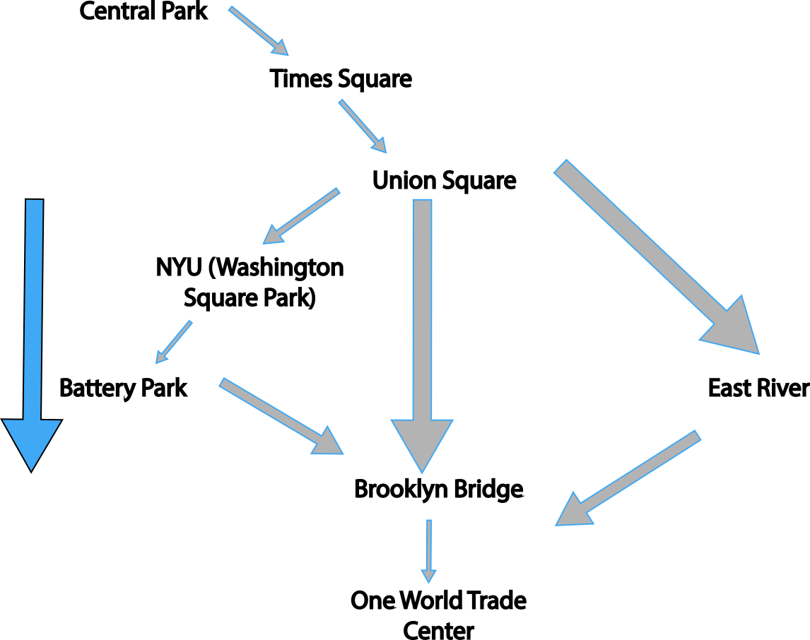

# NYC Map (Implemented using Dijkstra's Algorithm)

## Project
* Implemented a map covering only some parts of NYC using a graph.
* Using Dijkstra's algorithm, the program finds the fastest route to the destination.
* The fastest route is determined based on traffic, distance, and speed limit.
* The map assumes you are driving everywhere.
* Visual Map provided, look at nyc_map.jpg
* To run the program, run nyc_dijkstra.py
* Note: No UI provided, information about traffic, speed limit, and distance is displayed in the console.

## Places
1. One World Trade Center
2. NYU (Washington Square Park)
3. Union Square
4. Central Park
5. Times Square
6. Brooklyn Bridge
7. Battery Park
8. East River

## Graph
* Weight of edges is determined based on distance and traffic.

